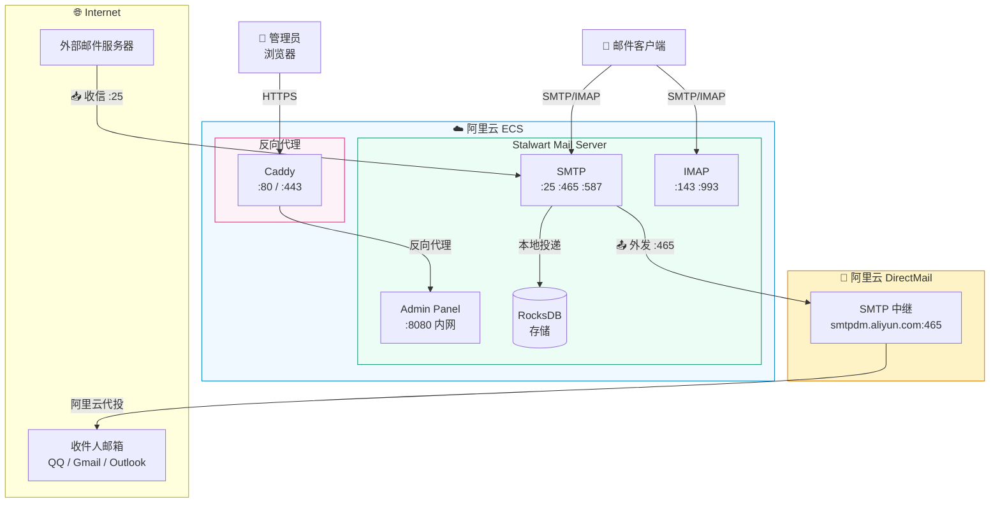

我把自己搭建邮件服务器的过程整理成了一个 [GitHub 仓库](https://github.com/7emotions/email-server)，包含完整的 Docker Compose 配置、Caddy 反向代理、部署前检查脚本和部署后验证脚本。本文是对整个方案的说明。

## 背景

在云服务器上自建邮件服务，最大的障碍不是安装配置，而是**出站 25 端口被封锁**。阿里云、腾讯云等国内厂商默认封锁 SMTP 出站端口，意味着服务器可以接收邮件，但无法直接投递到外部邮箱。

解决方案：通过**阿里云邮件推送（DirectMail）** 作为 SMTP 中继 — 邮件先提交到阿里云的 465 端口，再由阿里云代为投递到目标服务器。这也是生产环境的标准做法。

::github{repo="7emotions/email-server"}

## 为什么选 Stalwart？

市面上常见的自建邮局方案有 Mailu、Mailcow、iRedMail 等，它们功能完善但组件繁多（动辄 8-10 个容器），对 2GB 以下内存的服务器不友好。

[Stalwart Mail Server](https://stalw.art) 是一个用 Rust 从头编写的现代化邮件服务器，**单个容器**同时提供 SMTP、IMAP、JMAP 和 Web 管理面板，内存占用约 300MB。对比 Mailu 需要 9 个容器（Redis、Postfix、Dovecot、ClamAV、Rspamd 等），这在资源有限的 VPS 上是巨大的优势。

| 方案 | 容器数 | 内存占用 | 管理面板 | JMAP |
|---|---|---|---|---|
| Mailu | 9 | ~1.5 GB | ✅ | ❌ |
| Mailcow | ~15 | ~4 GB | ✅ | ❌ |
| **Stalwart** | **1** | **~300 MB** | ✅ | ✅ |

## 项目结构

仓库包含以下内容：

```
email-server/
├── compose.yaml           # Stalwart Docker Compose 配置
├── caddy/
│   └── Caddyfile.mail     # Caddy 反向代理配置
├── scripts/
│   ├── preflight.sh       # 部署前 8 项环境检查
│   └── verify.sh          # 部署后 14 项验证
└── README.md              # 完整部署指南
```

### compose.yaml — 极简配置

核心的 `compose.yaml` 仅 31 行，一个 service、两个 volume、几行日志配置，干净利落。

```yaml
# Stalwart Email Server — Docker Compose
# Domain: <YOUR_DOMAIN> | Image: ghcr.io/stalwartlabs/stalwart:v0.16
#
# Ports:
#   Mail: 25 (SMTP), 465 (SMTPS), 587 (Submission), 993 (IMAPS), 143 (IMAP)
#   Admin: 127.0.0.1:8080 (internal, behind Caddy reverse proxy)

services:
  stalwart:
    image: ghcr.io/stalwartlabs/stalwart:v0.16
    container_name: stalwart
    restart: unless-stopped
    ports:
      - "25:25"
      - "465:465"
      - "587:587"
      - "143:143"
      - "993:993"
      - "127.0.0.1:8080:8080"
    volumes:
      - stalwart-data:/opt/stalwart
    logging:
      driver: "json-file"
      options:
        max-size: "10m"
        max-file: "3"
    environment:
      - TZ=Asia/Shanghai

volumes:
  stalwart-data:
```

部署只需要三条命令：

```bash
docker volume create email-server_stalwart-data
docker compose up -d
# 浏览器打开 http://<服务器IP>:8080/admin 完成初始配置
```

### preflight.sh — 部署前环境检查

在 `docker compose up -d` 之前运行，自动检测 8 项环境前提：

1. Docker daemon 是否运行
2. Docker Compose 是否安装
3. 端口 25/465/587/993/8080 是否被占用
4. iptables DOCKER 链是否正常
5. 内存 ≥ 1 GiB
6. 磁盘可用 ≥ 20 GB
7. Swap 是否配置
8. DNS 解析是否正常

核心检查逻辑：

```bash
# Check 1: Docker Daemon
docker info >/dev/null 2>&1

# Check 3: Required Ports Free (25, 465, 587, 993, 8080)
for port in 25 465 587 993 8080; do
    ss -tlnp "sport = :$port" | grep -q LISTEN && occupied=true
done

# Check 5: RAM >= 1.0 GiB
total_mib=$(free -m | awk '/Mem:/ {print $2}')
[ "$total_mib" -ge 1024 ]

# Check 6: Disk Space >= 20 GB Free
free_gb=$(df -BG / | awk 'NR==2 {print $4}' | sed 's/G//')
[ "$free_gb" -ge 20 ]
```

全部通过才建议继续部署，避免半路踩坑。

### verify.sh — 部署后全面验证

`docker compose up -d` 完成后运行，14 项检查覆盖容器健康、端口连通性、服务响应和 DNS 解析：

- 所有容器是否正常运行
- 是否有容器在重启循环
- SMTP/IMAP 端口是否可达
- SMTP banner 是否返回
- DNS 解析是否正常
- 磁盘使用率 < 80%

全部通过意味着邮件服务器部署成功。

## 架构总览



## 关键配置点

### 1. DNS 记录

部署前需要在域名 DNS 配置 6 条记录：

- **MX** — 收信路由，指向 `mail.<DOMAIN>`
- **SPF** — 声明阿里云和自有服务器可代表域名发信
- **DKIM** — 邮件签名，防止伪造（从 Stalwart 管理面板获取公钥）
- **DMARC** — 收信方验证失败时的处理策略
- **SRV** — 客户端自动发现（可选）

### 2. 阿里云 DirectMail 中继

在 Stalwart 的 Outbound Settings 中配置 Routing Strategy：

```
IF  is_local_domain(rcpt_domain)  →  本地投递
ELSE                               →  aliyun 中继外发
```

这样发往自己域名的邮件本地存储，发往外部的邮件走阿里云中继，互不干扰。

### 3. SSL 证书

Stalwart 支持挂载 certbot 证书。需要注意的是 Let's Encrypt 的 `live` 目录只有 root 可遍历，需要额外执行：

```bash
chmod o+x /etc/letsencrypt/live /etc/letsencrypt/archive
chmod 644 /etc/letsencrypt/archive/<DOMAIN>/privkey*.pem
```

## 客户端使用

配置完成后，可以用任意邮件客户端连接：

| 协议 | 服务器 | 端口 | 加密 |
|---|---|---|---|
| SMTP | `mail.<DOMAIN>` | 465 | SSL/TLS |
| IMAP | `mail.<DOMAIN>` | 993 | SSL/TLS |

用户名填完整邮箱地址，密码填 Stalwart 中设置的邮箱密码。

## 总结

这个仓库把「自建邮件服务器」这件事做成了一个可复现的方案：

- **一条 compose up** 启动服务
- **preflight.sh** 帮你检查环境，避免部署到一半才发现问题
- **verify.sh** 帮你验证部署结果，不用自己逐项排查
- **README** 记录每一步操作，包括常见的坑和解决方案

300MB 内存跑一个完整邮件服务器，比 Mailu/Mailcow 轻量得多，适合个人 VPS 自用。

仓库地址：[github.com/7emotions/email-server](https://github.com/7emotions/email-server)
