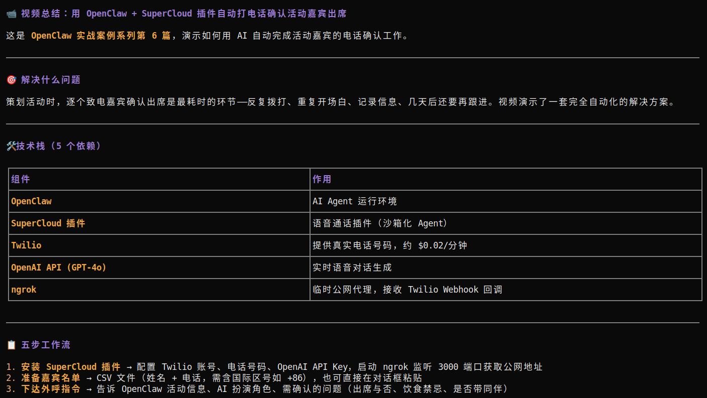

# 背景

在使用 AI 编程助手（如 OpenCode、Claude Code 等）时，有一个明显的痛点：**AI Agent 本质上是文本模型，它无法「观看」视频**。当我遇到一个技术视频想丢给它学习时，只能自己看一遍再做总结转述。而 OpenCode 的 Skill 机制恰好提供了扩展能力的接口——我可以写一个 Skill，让 Agent 在需要时自动调用，把视频转成它读得懂的文本。

于是有了

::github{repo="7emotions/video-transcript-skill"}

# 功能

这个 Skill 做的事情很直接：

1. **收到视频链接** → 触发 Skill
2. **尝试获取已有字幕** → 如果平台提供了字幕（B站、YouTube 通常有），几秒内返回结果
3. **字幕不可用时** → 用 `yt-dlp` 下载音频 → `ffmpeg` 转码 → 本地 Whisper 转录 → 返回完整文本

支持的平台：**Bilibili（B站）、YouTube、Vimeo、Twitch**，以及 [yt-dlp 支持](https://github.com/yt-dlp/yt-dlp/blob/master/supportedsites.md) 的数百个视频网站。

# 架构设计

## 为什么是 MCP？

Skill 本身只是一份指令文件（`SKILL.md`），告诉 Agent 在什么场景下该做什么。真正的「能力」需要由外部的 MCP Server 提供。

这里依赖的是 `video-toolkit` MCP Server，它暴露了三个关键工具：

| MCP Tool | 功能 | 耗时 |
|---|---|---|
| `get-transcript` | 获取平台已有字幕 | 秒级 |
| `generate-subtitles` | 下载音频 + Whisper 转录 | 分钟级 |
| `list-transcript-languages` | 查询可用字幕语言 | 秒级 |

## 双轨策略：字幕优先，Whisper 兜底

```
视频链接
    │
    ├── 有字幕？──→ get-transcript ──→ 直接返回（秒级）
    │
    └── 无字幕？──→ yt-dlp 下载音频
                        │
                    ffmpeg 转 16kHz 单声道
                        │
                    faster-whisper 转录
                        │
                    返回带时间戳的完整文本
```

这个策略的好处是：
- **大多数视频走得通第一条路径**，用户感知延迟很低
- **第二条路径是终极兜底**，只要 `yt-dlp` 能下载音频，就一定能出文本

# 技术选型

## yt-dlp — 通用视频下载

[yt-dlp](https://github.com/yt-dlp/yt-dlp) 是 youtube-dl 的活跃 fork，支持数百个视频平台。用它做音频下载层，意味着不需要为每个平台写适配代码。

```bash
# 只下载音频，转为 mp3
yt-dlp -x --audio-format mp3 "https://www.bilibili.com/video/BVxxxxxx"
```

## faster-whisper — CPU 上也能用的转录

OpenAI 的 Whisper 效果很好，但原版在 CPU 上太慢。`faster-whisper` 是 CTranslate2 加速的 Whisper 实现，同样的模型在 CPU 上快 4 倍，内存占用更低。

实际测试数据（4 核 CPU，small 模型）：

| 视频时长 | 转录耗时 | 倍速 |
|---|---|---|
| 5 分钟 | ~1 分钟 | 5x |
| 15 分钟 | ~3 分钟 | 5x |
| 30 分钟 | ~6.5 分钟 | 4.6x |
| 1 小时 | ~13 分钟 | 4.6x |

对于日常使用的 10-20 分钟视频，等待 2-3 分钟完全在可接受范围内。

## Whisper 包装脚本

MCP Server 需要调用 Whisper，但 `faster-whisper` 是 Python 库而非 CLI 工具。为了让 MCP Server 能像调用命令行工具一样使用它，我写了一个薄包装脚本（`scripts/whisper`）：

```python
#!/usr/bin/env python3
"""Thin wrapper around faster-whisper for CLI usage."""
import sys
import json
from faster_whisper import WhisperModel

model_size = "small"
model = WhisperModel(model_size, device="cpu", compute_type="int8")

segments, info = model.transcribe(sys.argv[1])
result = [{"start": s.start, "end": s.end, "text": s.text} for s in segments]
print(json.dumps(result, ensure_ascii=False))
```

# 如何使用

## 1. 安装依赖

```bash
pip install yt-dlp faster-whisper
# ffmpeg 请根据系统自行安装
# Ubuntu/Debian: sudo apt install ffmpeg
```

## 2. 安装 Whisper 包装脚本

```bash
git clone https://github.com/7emotions/video-transcript-skill.git
cp video-transcript-skill/scripts/whisper ~/.local/bin/whisper
chmod +x ~/.local/bin/whisper
```

## 3. 配置 video-toolkit MCP Server

```bash
git clone https://github.com/JamesANZ/video-transcript-mcp.git
cd video-transcript-mcp
npm install && npm run build
```

在 `opencode.jsonc` 中添加：

```json
"video-toolkit": {
  "type": "local",
  "command": ["node", "/path/to/video-toolkit-mcp/dist/index.js"],
  "enabled": true,
  "timeout": 600000,
  "environment": {
    "YT_DLP_PATH": "yt-dlp",
    "FFMPEG_PATH": "ffmpeg",
    "TRANSCRIPT_MCP_WHISPER_ENGINE": "local",
    "WHISPER_BINARY_PATH": "/home/ubuntu/.local/bin/whisper",
    "WHISPER_MODEL_PATH": "small"
  }
}
```

## 4. 安装 Skill

将 `SKILL.md` 放到 OpenCode 的 skills 目录，重启即可。

## 5. 使用

直接发视频链接给 Agent：

> "帮我总结一下这个视频 https://www.bilibili.com/video/BVxxxxxx"

Agent 会自动调用 Skill，先尝试获取字幕，失败则用 Whisper 转录，最终返回完整的文本内容供你分析和总结。

## 6. 案例

我在`Bilibili`中找到了`Terminator-AI`的视频[普通人用 OpenClaw 实战系列(6) ：自动打电话](https://www.bilibili.com/video/BV1kvPnz9EcA)

<iframe width="100%" height="468" src="//player.bilibili.com/player.html?isOutside=true&aid=116179838508314&bvid=BV1kvPnz9EcA&cid=36487761063&p=1" title="测试视频" frameborder="0" allowfullscreen></iframe>

以下是`Agent`学习的结果



# 局限与后续计划

**当前局限：**

- **CPU 转录速度有上限**：1 小时视频需要 ~13 分钟。如果有 GPU，速度可以提升 10 倍以上
- **部分平台需要认证**：B站某些视频需要登录才能获取字幕，此时会自动走 Whisper 降级路径
- **长视频可能超出上下文窗口**：超过 1 小时的视频转录文本可能超过 LLM 的上下文限制，需要分段处理

**计划中的改进：**

- [ ] 支持 GPU 加速（CUDA / Apple Silicon）
- [ ] 长视频自动分段 + 逐段总结
- [ ] 缓存已转录视频，避免重复转录
- [ ] 支持更多 Whisper 模型大小选择（tiny ~ large-v3）

# 结语

[video-transcript-skill](https://github.com/7emotions/video-transcript-skill) 本质上做了一件事：**给基于文本的 AI Agent 装上一双「耳朵」**。它不需要 Agent 理解视频画面，只需要让 Agent 听到视频里说了什么——而这已经覆盖了绝大多数技术教程、演讲、会议记录等场景。

如果你也在用 OpenCode 或其他支持 Skill/MCP 的 AI 编程工具，欢迎尝试。项目开源在 GitHub，MIT 协议，任何形式的贡献都欢迎。

> 项目地址：[github.com/7emotions/video-transcript-skill](https://github.com/7emotions/video-transcript-skill)
