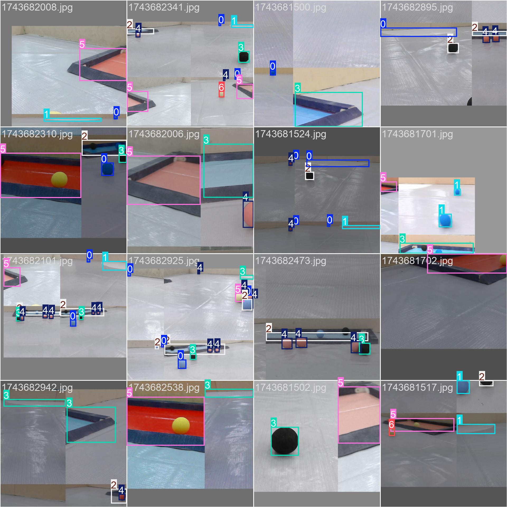

## 环境

1. docker compose

## 代码克隆

使用`git`克隆仓库

```bash
git clone https://github.com/7emotions/robot-vision.git
```

::github{repo="7emotions/robot-vision"}

## 数据集标定

在`yolo/`文件夹下（后续都在该工作目录），新建`dataset/images/`与`dataset/labels/`。使用`labelimg`标定数据集，`yolo`支持的数据集格式为

```
<class_id> <x_center> <y_center> <width> <height>
```

> [!NOTE]
> `label`文件的文件名需要与`image` 文件的文件名保持一致。

将图片文件与标签文件分别移动到`dataset/images/`与`dataset/labels`下。

## 数据集划分

运行`split.py`划分数据集

```shell
docker-compose run trainer python split.py
```

`split.py`会将数据集的`80%`划分为**训练集**，`20%`划分为**验证集**。对于缺失`labels`的负样本，会新建空白`label`。

划分后，`dataset/`的目录结构为

```
dataset/
├── images/
│   ├── train/
│   │   ├── image1.jpg
│   │   ├── image2.png
│   │   └── ...
│   └── val/
│       ├── image3.jpg
│       ├── image4.jpeg
│       └── ...
└── labels/
    ├── train/
    │   ├── image1.txt
    │   ├── image2.txt
    │   └── ...
    └── val/
        ├── image3.txt
        ├── image4.txt
        └── ...
```

## 数据配置文件

训练之前需要编写数据配置文件。修改`conf.yml`文件

```yml
train: dataset/images/train
val: dataset/images/val
nc: 7
names: ["red target", "blue area", "blue target", "starting point", "black target","yellow target","red area"]
```

其中，`nc`表示类别数目，`names`表示类别名称列表。

## 预训练权重文件

在`yolov10`仓库的[`Release`](https://github.com/THU-MIG/yolov10/releases)中提供预训练权重文件。此处以`yolov10s.pt`为例。

::github{repo="THU-MIG/yolov10"}

> [!NOTE]
> YOLOv10 系列通常会包含多个不同大小和复杂度的变体，以适应不同的计算资源和性能需求。这些变体通常会用后缀来区分，例如 -n（极小）、-s（小型）、-m（中型）、-l（大型）、-x（极大）等等。

> [!NOTE]
> 若更换预训练权重文件，请在`compose.yml`中替换`yolov10s.pt`。
>
## 模型训练

启动容器进行训练

```shell
docker-compose up -d
```

查看日志

```shell
docker-compose logs trainer -f
```

模型将输出在`runs/`目录下， 可查看到结果





## 模型导出

保存在`yolo/runs/deteçt/train/weights/`下的`.pt`文件可以通过以下命令导出为`.onnx`模型文件。

```shell
docker-compose run trainer yolo export model=runs/detect/train/weights/best.pt format=onnx
```

## 模型使用

以`cpp`为例，采用`OpenCV`导入`.onnx`模型。

```cpp
#include <iostream>
#include <fstream>
#include <string>
#include <vector>
#include <opencv2/opencv.hpp>
#include <opencv2/dnn.hpp>
#include <format>

int main() {
    std::string onnx_model_path = "best.onnx";
    std::string classes_path = "classes.txt";
    std::string image_path = "test.jpg";

    float confidenceThreshold = 0.5;
    float nmsThreshold = 0.4;

    cv::Net net = cv::dnn::readNetFromONNX(onnx_model_path);
    if (net.empty()) {
        std::cerr << "Error: Could not load ONNX model: " << onnx_model_path << std::endl;
        return -1;
    }
    std::cout << "ONNX model loaded successfully." << std::endl;

    std::vector<std::string> classes;
    std::ifstream ifs(classes_path);
    std::string line;
    if (ifs.is_open()) {
        while (getline(ifs, line)) {
            classes.push_back(line);
        }
    } else {
        std::cerr << "Error: Could not open classes file: " << classes_path << std::endl;
        return -1;
    }
    std::cout << "Loaded " << classes.size() << " classes." << std::endl;

    cv::Mat frame = cv::imread(image_path);
    if (frame.empty()) {
        std::cerr << "Error: Could not read image: " << image_path << std::endl;
        return -1;
    }
    int frameWidth = frame.cols;
    int frameHeight = frame.rows;

    cv::Mat blob;
    cv::dnn::blobFromImage(frame, blob, 1 / 255.0, cv::Size(640, 640), cv::Scalar(0, 0, 0), true, false);
    net.setInput(blob);

    cv::Mat output = net.forward();

    std::vector<int> classIds;
    std::vector<float> confidences;
    std::vector<cv::Rect> boxes;

    int rows = output.size[2];
    int cols = output.size[3];

    for (int i = 0; i < rows; ++i) {
        float confidence = output.at<float>(0, 0, i, 4);

        if (confidence > confidenceThreshold) {
            cv::Mat scores = output.row(i).colRange(5, cols);
            cv::Point classIdPoint;
            double maxScore;
            cv::minMaxLoc(scores, 0, &maxScore, 0, &classIdPoint);
            int classId = classIdPoint.x;

            if (maxScore > confidenceThreshold) {
                float centerX = output.at<float>(0, 0, i, 0) * frameWidth;
                float centerY = output.at<float>(0, 0, i, 1) * frameHeight;
                float width = output.at<float>(0, 0, i, 2) * frameWidth;
                float height = output.at<float>(0, 0, i, 3) * frameHeight;
                cv::Rect box(cv::Point(cvRound(centerX - width / 2), cvRound(centerY - height / 2)),
                             cv::Size(cvRound(width), cvRound(height)));

                classIds.push_back(classId);
                confidences.push_back(confidence * maxScore);
                boxes.push_back(box);
            }
        }
    }

    std::vector<int> indices;
    cv::dnn::NMSBoxes(boxes, confidences, confidenceThreshold, nmsThreshold, indices);

    for (int idx : indices) {
        cv::Rect box = boxes[idx];
        int classId = classIds[idx];
        float confidence = confidences[idx];

        cv::rectangle(frame, box, cv::Scalar(0, 255, 0), 2);
        
  std::string label = classes[classId] + ": " + std::format("{:.2f}", confidence);
        cv::putText(frame, label, cv::Point(box.x, box.y - 10), cv::FONT_HERSHEY_SIMPLEX, 0.5, cv::Scalar(0, 255, 0), 2);
    }

    cv::imshow("Detected Objects", frame);
    cv::waitKey(0);
    cv::destroyAllWindows();

    return 0;
}
```

